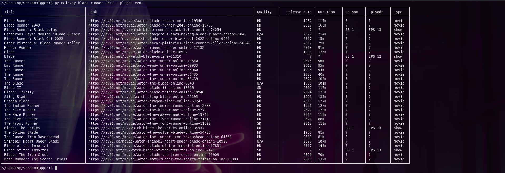

# StreamDigger
Look for movies, shows and anime on multiple streaming sites.

# Disclaimer
```
I, Symbolic, am not responsible for any damage you do!
I wrote this tool to experiment with webscraping and plugin systems, i didn't write it to harm any websites.
Use at your own risk!
```

# Usage
By default, StreamDigger uses the `ev01` plugin. You can change that using `--plugin <plugin name>` <br>
You can find all plugins by doing `python3 main.py --list-plugins`

## Basic usage
- Simple search query
```
python3 main.py <search query here>
```

- Changing plugin
```
python3 main.py <search query> --plugin <plugin name>
```

## Examples
- Looking for "Bladerunner 2049" on ultravid
```
python3 main.py bladerunner 2049 --plugin ultravid
```

- Looking for konosuba on 9anime
```
python3 main.py konosuba --plugin 9anime
```

# Images




# Help
You can help by
- Writing plugins
- Refactoring code (it tends to be a bit messy sometimes)
- Suggesting idea's

All help is welcome <3

# License
```
This project is free software: you can redistribute it and/or modify it under the terms of the GNU General Public License as published by the Free Software Foundation, 
either version 3 of the License, or (at your option) any later version.

This project is distributed in the hope that it will be useful, but WITHOUT ANY WARRANTY; 
without even the implied warranty of MERCHANTABILITY or FITNESS FOR A PARTICULAR PURPOSE. 
See the GNU General Public License for more details.

You should have received a copy of the GNU General Public License along with this code. 
If not, see <https://www.gnu.org/licenses/>. 
```